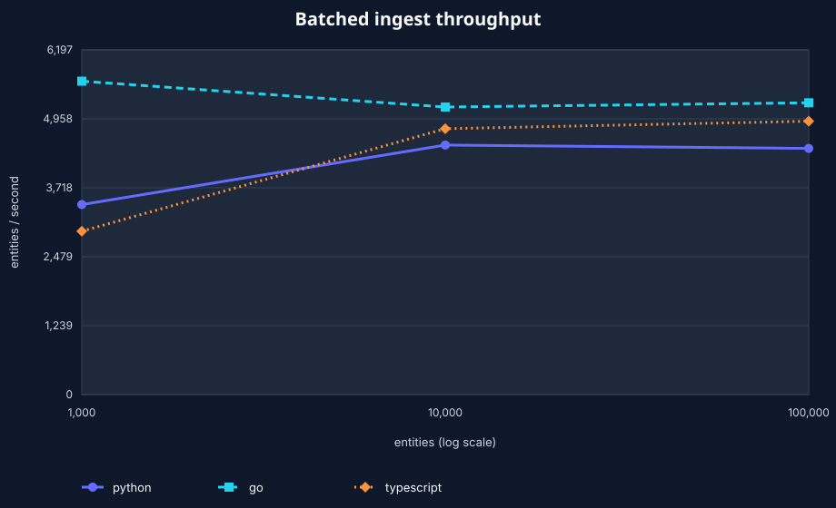
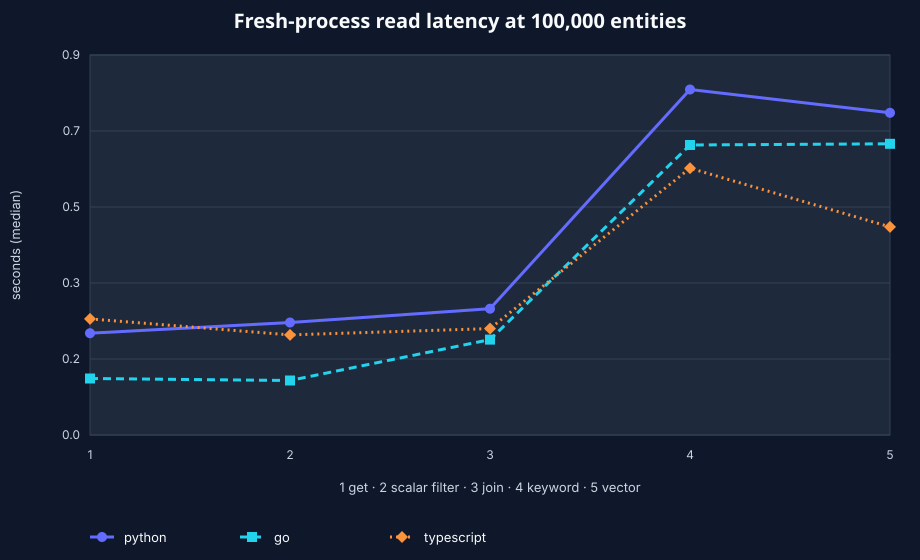

# fgraph

**A temporal fact graph in one SQLite file — schema-optional, attributable, portable, and built for local AI systems.**

fgraph stores knowledge as immutable EAV facts `⟨entity, attribute, value, asserted-tx, retracted-tx?⟩`. Current state is a view; history, provenance, and transaction receipts are first-class. It needs no server or loadable SQLite extension, yet provides bounded Datalog, keyword/vector search, exact snapshots, portable event replay, schema introspection, shapes, and a read-only-by-default MCP server.

## Why fgraph

- **Universal data model.** Add facts immediately; declare only the attributes that need types, refs, cardinality, uniqueness, vector-model identity, or validation shapes.
- **Time and provenance by construction.** `at`, `history`, `diff`, `why`, and durable receipts answer what changed, when, by whom, and from which source.
- **Agent-safe writes.** Operation ids make retries idempotent; basis checks reject stale decisions; cardinality-one CAS supports atomic create/replace/delete; `undo` writes an audited compensation.
- **Inspectable and portable schema.** Rich snapshots distinguish declared, effective, and observed behavior. A canonical `schema/1` manifest exports, checks, and atomically applies explicit declarations and shapes across runtimes.
- **Attributable retrieval.** FTS5 + caller-provided vectors + exact filters + graph expansion return matched facts and their asserting provenance. Search work and outputs are explicitly bounded.
- **Two honest portability paths.** `tail`/`apply` replicate logical `event/1` streams; `snapshot`/`restore` reproduce exact retained state, including history, receipts, and excision redactions.
- **One file, three native runtimes.** Python, Go, and TypeScript write the same logical rows and read each other's files. Shared conformance, differential traces, and an immutable format-v2 fixture enforce the contract.
- **Designed for local agents.** MCP is read-only unless `--write` is explicit, responses are capped, cursors are basis-pinned, and every tool publishes input/output schemas, safety annotations, and server instructions. No core code makes a network call.

## Python quickstart

From this checkout:

```bash
uv sync --project python
uv run --project python python examples/python/quickstart.py
```

The stable registry installation is `uv add 'fgraph>=1,<2'`.

```python
import fgraph

with fgraph.connect("memory.db") as db:
    initial = db.transact(
        {
            "id": "ada",
            "person/name": "Ada Lovelace",
            "person/city": "London",
        },
        source="wikipedia",
        by="importer",
        operation_id="person:ada:v1",
    )

    db.declare("person/knows", ref=True, many=True)
    db.transact({"id": "grace", "person/name": "Grace Hopper"})
    db.transact({"id": "ada", "person/knows": {"ref": "grace"}})
    move = db.transact({"id": "ada", "person/city": "Lyon"})

    assert db.entity("ada")["person/city"] == "Lyon"
    assert db.at(initial.tx).entity("ada")["person/city"] == "London"
    print(db.history("ada", "person/city"))
    print(db.why("ada", "person/city"))
    print(db.receipt(move.tx))

    result = db.q(
        find=["?friend"],
        where=[
            ["ada", "person/knows", "?entity"],
            ["?entity", "person/name", "?friend"],
        ],
    )
    assert result.rows == [["Grace Hopper"]]
```

`schema()` is the agent/tooling surface; it returns declared, effective, and observed behavior plus shapes and a digest. `attributes()` remains a compact human discovery API.

For a known cardinality-one attribute, `['cas', entity, attribute, expected, desired]` performs an atomic comparison. The exact `{ "missing": true }` sentinel creates an absent fact when used as `expected`, or deletes a present fact when used as `desired`.

## Go and TypeScript

The Go module is `github.com/fmind/fgraph/go` and is CGO-free. The strict ESM package is `@fmind-dev/fgraph` and targets the Node.js 24 LTS line (24.19+).

```bash
go get github.com/fmind/fgraph/go@v1.0.3
npm add @fmind-dev/fgraph@^1.0.3
```

```go
db, err := fgraph.Open("memory.db")
if err != nil {
    log.Fatal(err)
}
defer db.Close()

_, err = db.Transact(ctx,
    fgraph.E{"id": "ada", "person/name": "Ada Lovelace"},
    fgraph.WithOperationID("person:ada:v1"),
)
entity, err := db.Entity(ctx, "ada")
```

```typescript
import { connect } from "@fmind-dev/fgraph";

using db = connect("memory.db");
db.transact(
  { id: "ada", "person/name": "Ada Lovelace" },
  { operationId: "person:ada:v1" },
);
const rows = db.q({
  find: ["?name"],
  where: [["ada", "person/name", "?name"]],
}).rows;
```

Run the checked-in examples with `mise run test:examples`.

## CLI

All three implementations expose the same v1 commands. The examples below use an installed `fgraph`; from the checkout, substitute `uv run --project python fgraph`, `go/bin/fgraph`, or `node typescript/dist/cli.js` after building.

```bash
fgraph --db project.db add \
  --operation-id project-status-v1 \
  '{"id":"project","project/status":"v1 candidate"}'

# Bounded, resumable NDJSON loading. Completed batches survive interruption.
fgraph --db project.db add \
  --batch-size 500 \
  --operation-id-prefix import-project-v1 \
  - < entities.ndjson

fgraph --db project.db schema project/
fgraph --db project.db schema-export > project.schema.json
fgraph --db project.db schema-check @project.schema.json
fgraph --db project.db explain \
  '{"find":["?status"],"where":[["project","project/status","?status"]]}'
fgraph --db project.db datoms avet --components '["project/status"]'
fgraph --db project.db tx 67

# Portable logical replication.
fgraph --db project.db tail --since 64 > events.ndjson
fgraph --db replica.db apply events.ndjson

# Exact retained-state recovery.
fgraph --db project.db snapshot > snapshot.ndjson
fgraph --db restored.db restore snapshot.ndjson

fgraph --db project.db backup project-backup.db
fgraph --db project-backup.db doctor --json
```

Irreversible excision requires an idempotency key and the basis you reviewed:

```bash
basis="$(fgraph --db project.db schema --json | jq -r .basis_tx)"
fgraph --db project.db excise private-subject \
  --operation-id privacy-request-42 \
  --if-basis-tx "$basis"
```

## MCP for AI agents

`fgraph mcp` opens the database read-only and exposes:

`recall`, `about`, `why`, `history`, `query`, `datoms`, `receipt`, `schema`, and `explain`.

Opting into `mcp --write` adds `remember`, `forget`, and `undo`. Writes require operation ids; destructive calls also require a current basis. Every successful tool response uses `{"ok":true,"basis_tx":...,"data":...}` and is capped at 256 KiB. MCP initialization tells agents to inspect schema, preserve read bases, paginate, and guard writes; tool discovery includes output schemas and read/destructive/idempotent/open-world annotations.

```bash
# Read-only project knowledge base.
claude mcp add --scope project fgraph -- fgraph --db ./project.db mcp

# Explicitly writable agent memory.
claude mcp add --scope project fgraph-memory -- \
  fgraph --db ./agent-memory.db mcp --write
```

An optional `--embed-cmd` reads text on stdin and emits one JSON vector on stdout. It is shell-free and bounded; core never downloads models or calls a provider.

## Agent Skills

Install the small companion skills to teach a coding agent the fgraph model and its safe MCP workflow:

```bash
npx skills add fmind/fgraph --skill fgraph --skill fgraph-mcp
```

Use `fgraph` for data modeling, transactions, temporal reads, and queries. Use `fgraph-mcp` when configuring or operating an agent memory or project knowledge base over MCP.

## Benchmarks

The checked-in benchmark exercises each native CLI independently at 1k, 10k, and 100k named entities. The 100k workload writes three scalar application facts per entity plus 5,000 caller-provided 384-dimensional vectors: 305,000 application facts in 500-entity transactions. Read figures are medians of three fresh-process end-to-end CLI runs, so runtime and package startup are included. The harness invokes the installed Python entry point, compiled Go binary, and compiled Node.js CLI directly.





At 100,000 entities:

| Runtime    | Ingest entities/s | Point get | Scalar filter | Connected join | Keyword search | Exact vector search |
| ---------- | ----------------: | --------: | ------------: | -------------: | -------------: | ------------------: |
| Python     |             3,436 |    231 ms |        255 ms |         287 ms |         784 ms |              731 ms |
| Go         |             4,093 |    128 ms |        124 ms |         216 ms |         658 ms |              661 ms |
| TypeScript |             4,310 |    263 ms |        227 ms |         242 ms |         605 ms |              472 ms |

| Runtime    | Snapshot | Restore | Event tail | Event apply |
| ---------- | -------: | ------: | ---------: | ----------: |
| Python     |   7.33 s | 27.60 s |     3.43 s |     48.09 s |
| Go         |   6.16 s | 26.82 s |     3.72 s |     29.35 s |
| TypeScript |  11.23 s | 17.26 s |     3.74 s |     17.99 s |

The common logical state occupied 92.02 MiB; its snapshot was 60.53 MiB and its event stream 22.52 MiB. Vector search is intentionally exact over the 5,000 vectors, not ANN. These measurements validate the tested 100k envelope, not millions of entities or a service-level objective; SQLite build, filesystem, runtime startup, and hardware affect the numbers.

This release run was generated on 2026-08-27 from clean source commit [`34c89b5`](https://github.com/fmind/fgraph/commit/34c89b560a5ee5a75b9bb102c0b03f31002c8ec5) and source digest `sha256:5a3869b355d6a937d62b61018826173d463f7f926e69f100a769281943061153`. The raw metadata records the exact runtime, SQLite, platform, workload, and clean-tree provenance.

Reproduce the complete run with `mise run benchmark`. The harness has no timing pass/fail threshold and writes the [raw NDJSON observations](benchmarks/latest.ndjson) plus both accessible SVG charts.

## Data deletion and trust boundary

`nohistory` removes superseded fact rows but does **not** erase their canonical event payloads. For privacy deletion, `excise` removes all facts where a target is entity, attribute, or ref value and redacts every retained event that mentions it. The identity registry name remains, so use opaque names and keep sensitive identifiers in facts.

Snapshots/backups and external collectors are separate copies with their own retention policy. Event hashes detect corruption but are not tamper evidence: a writer that controls the file can rewrite it. Put file permissions, encryption, snapshots, and audit collection outside an untrusted agent's control.

## When not to use fgraph

Use another system for high-concurrency distributed writers, tamper-evident logs, large blobs, approximate vector retrieval at scale, or billion-edge analytics. fgraph is one durable SQLite writer with many readers and exact linear vector search. Run `mise run benchmark` on your corpus and hardware.

## Repository

- [`docs/content/docs/spec.md`](docs/content/docs/spec.md) — normative fgraph v1 / SQLite format-v2 contract.
- [`python/`](python/), [`go/`](go/), [`typescript/`](typescript/) — native peers.
- [`conformance/`](conformance/) — shared behavior, differential scenario, and immutable format-v2 fixture.
- [`examples/`](examples/) — runnable acceptance examples.
- [`docs/`](docs/) — Hugo documentation site.
- [`skills/`](skills/) — installable Agent Skills for fgraph users.
- [`CONTRIBUTING.md`](CONTRIBUTING.md) — the cross-runtime contribution contract.
- [`SECURITY.md`](SECURITY.md) — private reporting and the supported trust boundary.
- [`CHANGELOG.md`](CHANGELOG.md) — candidate and released user-visible changes.
- [`RELEASING.md`](RELEASING.md) — exact proof, publication, and rollback procedure.

The source gate is `mise run all`. No commit, package publication, or hosted deployment is implied by a local green candidate.

## License

[MIT](LICENSE) — © 2026 Médéric Hurier (Fmind).
