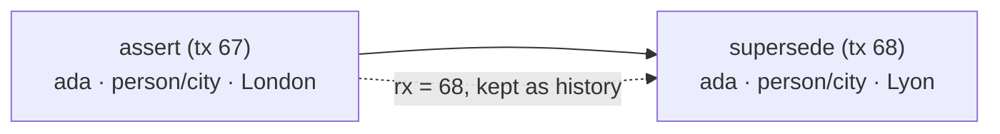

## Facts

Everything is a fact `⟨entity, attribute, value⟩` stamped with the transaction that asserted it (`tx`) and, once superseded or retracted, the transaction that ended it (`rx`). The present is simply the set of facts whose `rx` is empty — a partial index over the past.

## Entities and names

Entities are integers internally, but you address them by **name**: `{"id": "ada"}` always means _the entity named ada_, created on first use. Attributes (`person/name`) are themselves named entities — `entity("person/name")` shows an attribute's type, flags, and documentation.

## Schema is optional

Assert anything without declarations. Declare an attribute only for special behavior: `ref` (values are entities), `many` (multiple values), `unique` (enables upsert), `nohistory` (superseded values are deleted), `type`/`dims` (validation). Schema flags are ordinary facts — queryable and time-traveled like everything else.

## Time and provenance

Every transaction is an entity carrying `fgraph/at` (when), and optionally `fgraph/by` (who), `fgraph/source` (from where), and free metadata. That powers the audit APIs: `at()` (the database as of a moment), `history()` (a fact's timeline), `diff()` (what changed), and `why()` (a fact plus the full provenance of its transaction).

## Search

Hybrid retrieval over current facts: FTS5 keyword search (BM25) fused with bring-your-own-embeddings vector search via reciprocal rank fusion, filtered by attribute values, optionally expanded across references. Core never makes network calls — embeddings come from the caller or an external command. This doubles as a lightweight local RAG store: see [RAG with fgraph](rag).

## Undo and the audit stream

Because history accretes, correction is a first-class operation: `undo(tx)` writes a _compensating transaction_ — the audited "git revert" for memory. And because every write lands in the log, `changes(since)` / `follow()` (CLI: `fgraph tail --follow`) turn the store into an event stream: pipe it into `jq`, a collector, or a supervisor.

## One pure file, built for agent VMs

The format is plain SQLite tables (see the [specification](spec)) — no extension is required to read a fgraph file, ever. Single writer, many concurrent readers (WAL). This is a deliberate bet on where agents are heading: one VM or sandbox per agent, where a database must be a file, not a service. Provisioning is opening a path; snapshot, fork, and restore are file operations (`fgraph backup` uses SQLite's `VACUUM INTO` for safe hot backups; Litestream replicates continuously); and a host can audit an agent's memory by tailing the file read-only from outside — the agent cannot hide writes, because the file is the interface. Comfortable in the millions-of-facts range; not a billion-edge analytics engine, by design.
