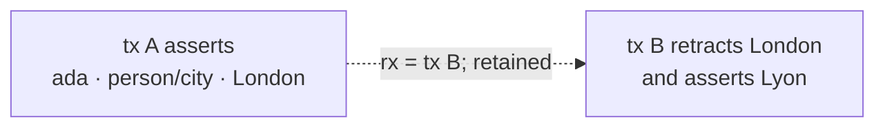

## Facts make time explicit

Each fact is `⟨entity, attribute, value, tx, rx?⟩`. The asserting transaction is immutable. Supersession or retraction sets `rx`; current state is the partial index where `rx` is empty.

Every transaction is also an entity with an integer-microsecond `fgraph/at` fact and optional `by`, `source`, metadata, and custom audit facts. Its stable event UUID and hashes live in a durable receipt.

## Names are local; EIDs are portable

Named identities are convenient and permanent: `{"id":"ada"}` always means the entity named `ada`. Attributes such as `person/name` are named entities too. Anonymous entities and transactions have stable UUID EIDs on portable events and snapshots. Numeric ids and fact-row ids are local implementation details.

Names remain in the identity registry after excision. Use opaque names when privacy deletion matters; store emails, external ids, and human names as facts.

## Optional schema, rich introspection

New attributes need no declaration. Declare only invariants:

- type and ref semantics;
- cardinality one/many and uniqueness;
- nohistory behavior;
- vector dimensions and embedding-model identity;
- documentation.

Declarations are ordinary temporal facts, so a historical view sees its historical schema. `attributes()` is compact discovery. `schema()` is the machine contract: a basis-pinned snapshot of `declared`, `effective`, and `observed` behavior, assigned shapes, and a digest over behavioral schema.

Shapes add opt-in entity validation. A shape can require attributes and, when closed, reject application attributes outside an allowed set. Transactions validate their final state atomically, independent of input order.

## Idempotency and optimistic concurrency

`operation_id` makes a write retryable. The same canonical request returns the original receipt as `already_applied`; a different request under that id is a conflict. `if_basis_tx` asserts the state the caller reviewed. If another write has advanced the basis, fgraph rejects the stale operation instead of applying it to surprising state.

These two controls are especially important for agents, where tool retries and stale context are normal. MCP requires operation ids for writes and basis checks for destructive calls. CLI excision requires both.

For a reviewed cardinality-one cell, `['cas', entity, attribute, expected, desired]` adds a narrower atomic guard. Both identities must already exist. The exact `{"missing":true}` sentinel creates an absent fact when used as `expected`, or deletes a present fact when used as `desired`. Another operation touching that cell in the same transaction is a conflict.

## Query at the right abstraction

- `entity`/`pull` reads one object-shaped projection.
- `history`, `why`, `receipt`, and `diff` explain the temporal audit trail.
- Canonical JSON Datalog joins across facts, including transaction and added/retracted positions in history mode.
- `explain` exposes stable logical access paths and the query budget without evaluating the result.
- `datoms` pages EAVT, AVET, or VAET at a pinned basis for generic tools and power users.
- Read-only SQL views remain an escape hatch for SQLite-native analysis.

## Search is attributable and bounded

Search combines FTS5 BM25 with exact cosine similarity over one explicit vector attribute, then fuses entity ranks with Reciprocal Rank Fusion. Exact filters run before ranking. Optional ref expansion brings nearby entities into the answer.

Every hit includes matched facts and their asserting time/provenance plus a compact pull. The API caps `k`, expansion, filters, candidate work, match size, expanded nodes, and the final 1 MiB response. Vector search is deliberately linear; see [RAG with fgraph](../rag/) for the honest scale boundary.

## Events and snapshots solve different problems

`event/1` NDJSON is the portable logical replication surface. `tail` streams it; `apply` validates a complete stream, merges names, preserves stable event ids, records replay provenance, and commits atomically. Local fact ids are therefore not expected to match.

`snapshot/1` is exact retained-state recovery. It includes receipts, historical facts, retractions, and redaction state with a checksummed footer. `restore` reconstructs the same logical core in a pristine file.

After excision, prior event payloads that mentioned the target are intentionally unavailable and cannot be applied. Snapshot/restore is therefore the exact recovery path; tail/apply is the live logical-replication path.

## Deletion has two boundaries

`nohistory` deletes superseded fact rows, mainly for high-churn values such as vectors. It does not remove the same values from canonical event receipts.

`excise` is privacy deletion: it removes every fact where the target is an entity, attribute, or ref value and semantically redacts retained event payloads. The redaction receipt remains auditable. Backups, snapshots, and external collectors are separate copies that need their own retention policy.

## One file is not a distributed system

WAL gives one writer and many concurrent readers. Online backup, snapshots, and external `tail --follow` collection fit an agent VM well. Event hashes detect corruption but are not tamper evidence: a writer controlling the file can rewrite it. Put filesystem permissions, encryption, backups, and audit collection outside an untrusted agent's boundary.
